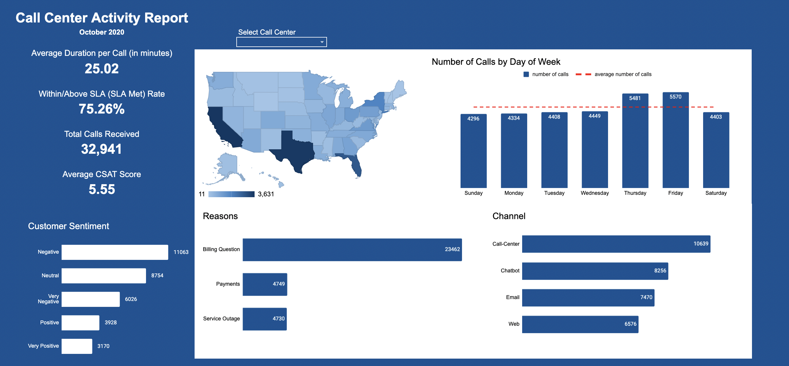

# Call Center Activity Report

## Project Overview

In this repository I will utilize the call center dataset to create a dashboard for tracking performance of a call center company in the United States on October 2020.

The data is sourced from the Real World Fake Data, a community project to curate amazing examples from the Tableau Community for real-world applications. The datasets from Real World Fake Data is meant to be used on Tableau but for this project, I'm going to use Google Sheets instead of Tableau to create the dashboard.

Link to the dataset source: [Call Center](https://data.world/markbradbourne/rwfd-real-world-fake-data/workspace/file?filename=Call+Center.csv)


## Why Google Sheets? 

Spreadsheet software like Google Sheets (and also Microsoft Excel) are still widely used tool for data analysis and it’s always a good tool to have under your belt. Another reason is that the Google Sheets has the [QUERY()](https://support.google.com/docs/answer/3093343?hl=en) function, which really did a good job to make the dashboard dynamic and interactive.

## Creating the Dashboard

If you want to just jump straight to the dashboard: [Call Center Dashboard](https://docs.google.com/spreadsheets/d/10yAh9LEfpR2D792vERxrKSo3nFNUP1EW-vBQ7NUBhPQ/edit#gid=1551418728)

Before going to the step-by-step analysis. Let me share the preview of the dashboard below:



Here's the step I take to create the dashboard:

### Step 1: Make sure the data is good to go.

This step is crucial to make sure that the dashboard component created is right. First, check out the missing value on each column. The only column that have missing value is the `csat_score`. Since CSAT score is usually depends on whether customer answer the customer feedback question survey or not (and it is not required), we can leave the data as it is (more on CSAT score [here](https://www.qualtrics.com/au/experience-management/customer/what-is-csat/?rid=ip&prevsite=en&newsite=au&geo=ID&geomatch=au)). 

Next thing to do is to make sure the data type is right especially on numeric and date columns. The numeric/date columns are `csat_score`, `call duration in minutes`, and `call_timestamp`. Format the cell in those columns by go to menu bar then `Format -> Number`.

### Step 2: Create table and charts

In this step, we will create the table using [QUERY()](https://support.google.com/docs/answer/3093343?hl=en)  function and insert chart based on the query result table that will be used later in our dashboard. For the convenience purpose, each of the table and the chart is created on separate sheet/tab to keep things tidy. These are the chart that will be created for the dashboard:

1. Bar chart for the customer sentiment.
2. Geo chart for showing the number of calls on each US state.
3. Combo chart (column chart + line chart) for number of calls each day and showing the average number of call.
4. Bar chart for the reason of calling.
5. Bar chart for the call channel.

Below are the query I use to create the table that will be used for the input of the chart.

1. Bar chart for the customer sentiment.
```
=QUERY(
  'Call Center'!A1:L32942, 
  "SELECT C, COUNT(A) GROUP BY C ORDER BY  COUNT(A) DESC LABEL COUNT(A) 'number of calls'", 
  1
)
```

2. Geo chart for showing the number of calls on each US state.
```
=QUERY('Call Center'!A1:L32942, "SELECT H, COUNT(A) GROUP BY H LABEL COUNT(A) 'number of calls'", 1)
```

3. Combo chart (column chart + line chart) for number of calls each day and showing the average number of call. Since the DAYOFWEEK() function return the day code instead of the day name, I created a new column for the day name, and another column to calculate the average number of calls.
```
=QUERY(
  'Call Center'!A1:L32942, 
  "SELECT DAYOFWEEK(E), COUNT(A) GROUP BY DAYOFWEEK(E) LABEL DAYOFWEEK(E) 'weekday code', COUNT(A) 'number of calls'",
  1
)
```

4. Bar chart for the reason of calling.
```
=QUERY('Call Center'!A1:L32942, "SELECT F, COUNT(A) GROUP BY F LABEL COUNT(A) 'number of calls'", 1)
```

5. Bar chart for the call channel.
```
=QUERY('Call Center'!A1:L32942, "SELECT I, COUNT(A) GROUP BY I LABEL COUNT(A) 'number of calls'", 1)
```

### Step 3: Create the Dashboard!

After we create the charts, it's time to put them together into a single sheet Dashboard. 

Other than the chart. We need to create the KPI for the call center that consists of:

- Average duration per call
- SLA Met rate
- Total call received
- Average CSAT score

These KPIs above can be calculated using basic aggregate function such as `AVERAGE()` or `COUNT()` but to make the dashboard interactive, we use the `QUERY()` function instead. 

The last thing we need to add, and the most important part to make the dashboard more interactive, is to create a drop-down list of call center that functions as a filter to our KPIs and charts. This is really useful to see the performance of the call center for each call center.

We can create the drop-down list by using the `Data Validation` menu by click the cell we want to create the drop-down list and go to `Data -> Data Validation`. Since we want the drop-down list of the call center, set the criteria into `List of a range` and select the `call_center` column from the dataset.

After we create the drop-down list, we need to make the drop-down list to serve as a filter for the dashboard charts and KPIs. To do this, modify each of the `QUERY()` function that we used to create charts and KPIs by adding the `WHERE L ='"&Dashboard!G4&"'`, where the column L is the `call_center` column and `Dashboard!G4` is the drop-down list cell. This is the main reason we use `QUERY()` function to create the dashboard, it allows us to make the dashboard more interactive just by adding the `WHERE` clause to filter the result based on the drop-down list cell value.

The dashboard is basically done! All we need to do is to complete the finishing: Color, font, etc. That was it! To use it, just click on the drop-down list to see the call center performance on specific call center. If you want to see the performance of all of them, just set the drop-down list cell value to blank. 
