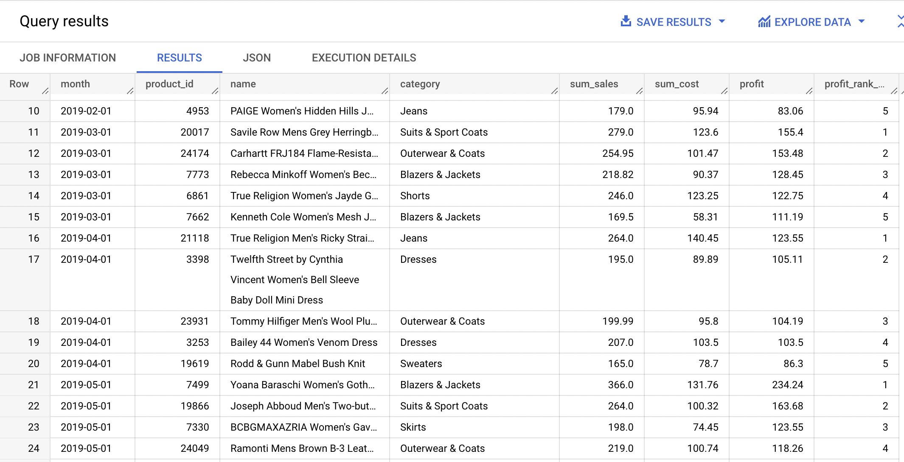
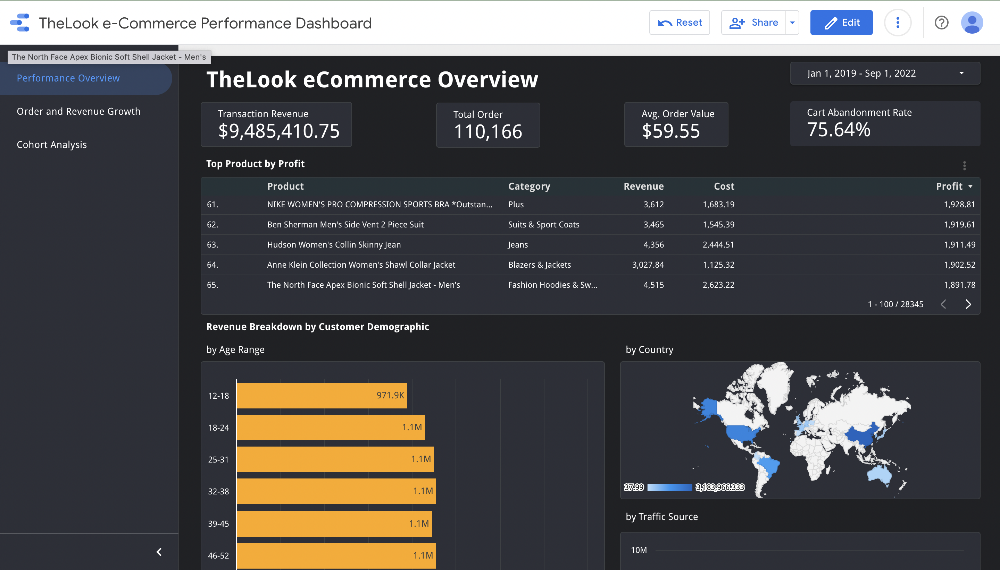
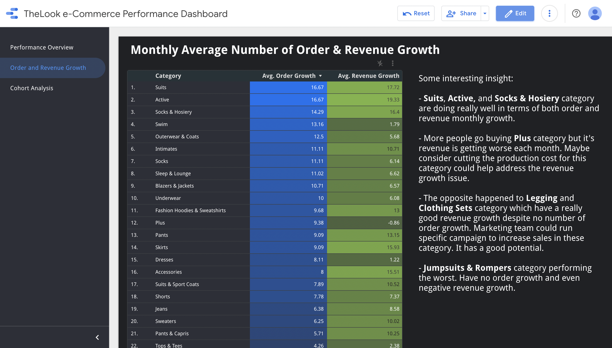
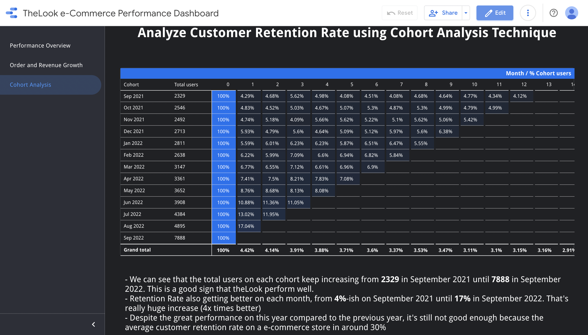

# theLook e-Commerce Sales Performance Analysis

## Project Overview

Imagine you are a data analyst working in the marketing team at theLook, an online store company that focus on selling fashion stuffs. The director of marketing want to know how is the sales performance of the store. The marketing team also want to know how is the average monthly growth in terms of revenue and number of orders, and how is the customer retention rate over the last year.

The director of marketing ask you, as the data analyst, to analyze all of the question above and provide some actionable insight to the marketing team to make the sales performance much better.

## Approach 

To tackle this problem, I decided to analyze the data using SQL query inside the Google Bigquery data warehouse. Then make the interactive dashboard using Google Data Studio as a report to my analysis.

I divide the analysis into three parts:

1. **Overall Sales Performance**
    * How much are we selling? How many orders going on? And What is the average sales on each order on monthly basis
    * What is the monthly cart abandonment rate? That is, the ratio of customer that decided to not continue purchase the product after they put it in the cart
    * What is the top 5 most profitable product on theLook e-commerce store on each month and how much is the profit? Are some product categories selling more than the other?
    * Who are our customers? Where are they come from? Find out the revenue that customer bring break down by demographics
2. **Order and Revenue Growth**
    * Find monthly growth of number of completed orders and revenue in percentage breakdown by product categories, ordered by time descendingly (Jan 2019 until Sep 2022). After analyzing the monthly growth, is there any interesting insight that we can get?
3. **Analyze Customer Retention Rate**
    * Create monthly retention cohorts (the groups, or cohorts, can be defined based upon the date that a user purchased a product) and then how many of them (%) coming back for the following months in 2019 – 2022. After analyzing the retention cohort, is there any interesting insight we can get?

## Dataset 

The dataset used for this project is `thelook_ecommerce` which was part of the Google BigQuery's public dataset. The tables that we going to use in the `thelook_ecommerce` schema:

- `orders`: Order made by the customer
- `order_items`: List of items contained on each order in `orders`
- `products`: Provide the detail information of the product
- `users`: Customer detailed information
- `events`: Record customer activity inside `thelook_ecommerce` website

You can access the dataset by click the link: [here](https://console.cloud.google.com/bigquery?p=bigquery-public-data&d=thelook_ecommerce&page=dataset&project=fiery-nimbus-360723)

```
Note: This project is solved and updated on 30 September 2022. The result may be different if you try to do the project even you follow the step below completely because the dataset might be updated by the Google team.
```

## Overall Sales Performance

You can see the full query for overall sales performance [here](overall-sales-performance.sql)

### **How much are we selling? How many orders going on? And What is the average sales on each order on monthly basis**

```sql
SELECT
  FORMAT_TIMESTAMP('%Y-%m', o.created_at) AS order_month,
  ROUND(SUM(oi.sale_price), 2) AS revenue,
  ROUND(AVG(sale_price), 2) AS average_sales,
  COUNT(DISTINCT o.order_id) AS order_count
FROM
  `bigquery-public-data.thelook_ecommerce.orders` o
  JOIN `bigquery-public-data.thelook_ecommerce.order_items` oi ON o.order_id = oi.order_id
WHERE
  DATE(o.created_at) BETWEEN '2019-01-01' AND '2022-09-30'
  AND o.status NOT IN ('Cancelled', 'Returned')
GROUP BY
  order_month
ORDER BY
  order_month;
```

Here are the first 5 rows and last 5 rows of the result : 

|order_month|revenue|average_sales|order_count|
|---|---|---|---|
|2019-01|1252.97|48.19|20|
|2019-02|5288.19|53.42|68|
|2019-03|6959.66|51.94|95|
|2019-04|11192.75|51.82|152|
|2019-05|14810.77|53.86|201|
|---|---|---|---|
|2022-05|417297.75|61.7|4715|
|2022-06|433767.65|58.32|5164|
|2022-07|538160.6|60.31|6098|
|2022-08|626101.02|59.59|7213|
|2022-09|983550.46|59.46|11460|

From the table above we can see that the average sales on each order remain stable ranging at $50 - $60 but the monthly revenue keep increasing from under $50k in 2019 until almost $1 million on September 2022 due to the increase of amount of order and the customer.

### **What is the monthly cart abandonment rate? That is, the ratio of customer that decided to not continue purchase the product after they put it in the cart.**

```sql
WITH cart_to_purchase AS (
  SELECT
    SUM(IF(event_type = 'cart', 1, 0)) AS cart,
    SUM(IF(event_type = 'purchase', 1, 0)) AS purchase
  FROM
    `bigquery-public-data.thelook_ecommerce.events`
)
SELECT 
  ROUND((1 - (purchase / cart)) * 100, 2) AS cart_abandonment_rate
FROM
  cart_to_purchase;
```

|cart_abandonment_rate|
|---|
|69.46|

Almost 70% customer that already put the product they want to buy into cart decided not to purchase it. 

### **What is the top 5 most profitable product on theLook e-commerce store on each month and how much is the profit? Are some product categories selling more than the other?**

```sql
WITH product_profit AS (
  SELECT
    DATE(DATE_TRUNC(oi.created_at, month)) AS month,
    oi.product_id,
    p.name,
    p.category,
    ROUND(SUM(oi.sale_price), 2) AS sum_sales,
    ROUND(SUM(p.cost),2) AS sum_cost,
    ROUND(SUM(oi.sale_price)-SUM(p.cost),2) AS profit
  FROM
    `bigquery-public-data.thelook_ecommerce.order_items` oi
    LEFT JOIN `bigquery-public-data.thelook_ecommerce.products` p ON oi.product_id = p.id
  WHERE
    DATE(oi.created_at) BETWEEN '2019-01-01' AND '2022-09-30'
    AND oi.status NOT IN ('Cancelled', 'Returned')
  GROUP BY
    month,
    product_id,
    name,
    category
)
SELECT
  month,
  product_id,
  name,
  category,
  sum_sales,
  sum_cost,
  profit,
  RANK() OVER(PARTITION BY month ORDER BY profit DESC) AS profit_rank_per_month
FROM 
  product_profit
QUALIFY
  profit_rank_per_month <= 5
ORDER BY 
  month,
  profit DESC;

```

Query Result: 


From the result above, it seems that **Suits & Sport Coats**, **Outwear & Coats**, and **Blazers & Jackets** are the most profitable product category!

### **Who are our customers? Where are they come from? Find out the revenue that customer bring break down by demographics**

```sql
-- by age range
SELECT
  CASE
    WHEN age >= 12 AND age < 18 THEN "12-18"
    WHEN age >= 18 AND age < 25 THEN "18-24"
    WHEN age >= 25 AND age < 32 THEN "25-31"
    WHEN age >= 32 AND age < 39 THEN "32-38"
    WHEN age >= 39 AND age < 46 THEN "39-45"
    WHEN age >= 46 AND age < 53 THEN "46-52"
    WHEN age >= 53 AND age < 60 THEN "53-59"
    ELSE "60+"
  END AS age_range,
  ROUND(SUM(oi.sale_price)) AS revenue
FROM
  `bigquery-public-data.thelook_ecommerce.users` u
  JOIN `bigquery-public-data.thelook_ecommerce.order_items` oi ON oi.user_id = u.id
GROUP BY
  age_range
ORDER BY
  revenue DESC;
```
|age_range|revenue|
|---|---|
|60+|1990363|
|53-59|1314100|
|18-24|1288713|
|32-38|1278001|
|46-52|1274286|
|39-45|1263847|
|25-31|1260455|

Surprisingly, the oldest age range (60+) are the one who brings the most revenue.

```sql
-- by country
SELECT
  country,
  ROUND(SUM(oi.sale_price)) AS revenue
FROM
  `bigquery-public-data.thelook_ecommerce.users` u
  JOIN `bigquery-public-data.thelook_ecommerce.order_items` oi ON oi.user_id = u.id
GROUP BY
  country
ORDER BY
  revenue DESC;
```
Top 5 country by revenue:
|country|revenue|
|---|---|
|China|3619123|
|United States|2482847|
|Brasil|1573743|
|South Korea|579075|
|United Kingdom|493637|

```sql
-- by traffic source
SELECT
  traffic_source,
  ROUND(SUM(oi.sale_price)) AS revenue
FROM
  `bigquery-public-data.thelook_ecommerce.users` u
  JOIN `bigquery-public-data.thelook_ecommerce.order_items` oi ON oi.user_id = u.id
GROUP BY
  traffic_source
ORDER BY
  revenue DESC;
```
|traffic_source|revenue|
|---|---|
|Search|7518772|
|Organic|1607993|
|Facebook|641998|
|Email|562082|
|Display|442806|

Most customer visit theLook website via search engine.

To make the analysis visually better and easier to understand, let's make the interactive dashboard report using Google Data Studio. The dashboard have a date range as a filter to make it easier for the marketing team to see the sales performance on a particular date range.

Below are the preview of the overall sales performance dashboard:



Click [here](https://datastudio.google.com/reporting/247011c5-79c1-4ba3-9dbb-96279f939f59/page/UeL3C) for the interactive dashboard if you're interested on exploring more!

## Revenue and Number of Order Growth

After we have the insight of how are theLook overall sales performance we want to know the monthly revenue and number of order growth to know better what product category that doing good or bad, and have the potential to grow more.

The first step is to find out the total revenue and number of order for each category and month that can be achieved by the query below:

```sql
SELECT
  DATE(DATE_TRUNC(oi.created_at, month)) AS month,
  p.category,
  COUNT(DISTINCT oi.order_id) AS completed_order,
  ROUND(SUM(oi.sale_price)) AS revenue
FROM
  `bigquery-public-data.thelook_ecommerce.order_items` oi
  JOIN `bigquery-public-data.thelook_ecommerce.products` p ON oi.product_id = p.id
WHERE
  DATE(oi.created_at) BETWEEN '2019-01-01' AND '2022-08-31'
  AND oi.status = 'Complete'
GROUP BY
  category,
  month
ORDER BY
  category,
  month
```
Preview:
|month|category|completed_order|revenue|
|---|---|---|---|
|2019-02-01|Accessories|4|117|
|2019-03-01|Accessories|3|195|
|2019-04-01|Accessories|3|144|
|2019-05-01|Accessories|5|111|
|2019-06-01|Accessories|8|364|

Then continue with calculate the last month completed order and revenue using `LAG()` window function and find the monthly growth by using this formula : 

$$(1 - {current.revenue \over last.month.revenue}) * 100\%$$

The same formula can be used for number of order growth. Let's apply the formula and commbine the previous query using the below query.

```sql
WITH cte_order_revenue AS (
  SELECT
    DATE(DATE_TRUNC(oi.created_at, month)) AS month,
    p.category,
    COUNT(DISTINCT oi.order_id) AS completed_order,
    ROUND(SUM(oi.sale_price)) AS revenue
  FROM
    `bigquery-public-data.thelook_ecommerce.order_items` oi
    JOIN `bigquery-public-data.thelook_ecommerce.products` p ON oi.product_id = p.id
  WHERE
    DATE(oi.created_at) BETWEEN '2019-01-01' AND '2022-08-31'
    AND oi.status = 'Complete'
  GROUP BY
    category,
    month
  ORDER BY
    category,
    month
)
SELECT
  month,
  category,
  ROUND((completed_order - LAG(completed_order, 1) OVER(PARTITION BY category ORDER BY month)) * 100.0 / LAG(completed_order, 1) OVER(PARTITION BY category ORDER BY month), 2) AS completed_order_growth_percentage,
  ROUND((revenue - LAG(revenue, 1) OVER(PARTITION BY category ORDER BY month)) * 100.0 / LAG(revenue, 1) OVER(PARTITION BY category ORDER BY month), 2) AS revenue_growth_percentage
FROM 
  cte_order_revenue
ORDER BY
  category,
  month;
```
Preview:
|month|category|completed_order_growth_percentage|revenue_growth_percentage|
|---|---|---|---|
|2019-02-01|Accessories|null|null|
|2019-03-01|Accessories|-25|66.67|
|2019-04-01|Accessories|0|-26.15|
|2019-05-01|Accessories|66.67|-22.92|
|2019-06-01|Accessories|60|227.93|

The follow up analysis is to calculate the average monthly growth group by each category. But it's better to done this step directly using the Google Data Studio and finish the report there. Below are the preview of the second page of the report.



Click [here](https://datastudio.google.com/reporting/247011c5-79c1-4ba3-9dbb-96279f939f59/page/p_bnsr30p1yc) to open the more detailed report.

## Customer Retention Rate Analysis

The last thing we want to analyze is the how often customer will return after their first order on theLook store. This time we'll be using a technique called cohort analysis. Cohort analysis table is used to visually display how many of the users are still active after a period of time group by the cohort. 

To create a cohort analysis table, first we need to group the user by cohort. Cohort is essentially a group of people. In this case, the cohort are grouped based upon the date that a user purchased a product on the first time.

What we want to analysis is how many of them (%) coming back for the following month. I will make the cohort table from January 2019 until September 2022 in the Google Data Studio report, but for the sake of simplicity, I'm gonna focus the analysis on the last one year, that is between September 2021 and September 2022.

Let's begin the query for cohort analysis. The first step we need to do is to group the user by each cohort that we've already defined earlier. 

```sql
-- group each customer based on their cohort
SELECT
  user_id,
  DATE(created_at) AS order_date,
  DATE(DATE_TRUNC(FIRST_VALUE(created_at) OVER(PARTITION BY user_id ORDER BY created_at), month)) AS cohort
FROM
  `bigquery-public-data.thelook_ecommerce.orders`
WHERE 
  DATE(created_at) BETWEEN '2019-01-01' AND '2022-09-30'
```

Then calculate the difference month between the current month when the user make current order and the cohort month where user make the first order

```sql
-- group each customer based on their cohort
WITH cohorts AS (
  SELECT
    user_id,
    DATE(created_at) AS order_date,
    DATE(DATE_TRUNC(FIRST_VALUE(created_at) OVER(PARTITION BY user_id ORDER BY created_at), month)) AS cohort
  FROM
    `bigquery-public-data.thelook_ecommerce.orders`
  WHERE 
    DATE(created_at) BETWEEN '2021-08-01' AND '2022-08-31'
)
-- calculate the number of months after the first month
SELECT
  user_id,
  cohort,
  DATE_DIFF(order_date, cohort, month) AS month_since_first_order
FROM 
  cohorts
```

followed by the counting the number of unique customer for each pair of `cohort` and `month_since_first_order`

```sql
-- group each customer based on their cohort
WITH cohorts AS (
  SELECT
    user_id,
    DATE(created_at) AS order_date,
    DATE(DATE_TRUNC(FIRST_VALUE(created_at) OVER(PARTITION BY user_id ORDER BY created_at), month)) AS cohort
  FROM
    `bigquery-public-data.thelook_ecommerce.orders`
  WHERE 
    DATE(created_at) BETWEEN '2021-08-01' AND '2022-08-31'
),
-- calculate the number of months after the first month 
activity AS (
  SELECT
    user_id,
    cohort,
    DATE_DIFF(order_date, cohort, month) AS month_since_first_order
  FROM 
    cohorts
)
-- counting the number of unique users for each cohort and month_since_first_order
SELECT
  cohort,
  month_since_first_order,
  COUNT(DISTINCT user_id) AS new_user
FROM
  activity
GROUP BY
  cohort,
  month_since_first_order
```

followed by the calculation of the cohort users

```sql
-- group each customer based on their cohort
WITH cohorts AS (
  SELECT
    user_id,
    DATE(created_at) AS order_date,
    DATE(DATE_TRUNC(FIRST_VALUE(created_at) OVER(PARTITION BY user_id ORDER BY created_at), month)) AS cohort
  FROM
    `bigquery-public-data.thelook_ecommerce.orders`
  WHERE 
    DATE(created_at) BETWEEN '2021-08-01' AND '2022-08-31'
),
-- calculate the number of months after the first month 
activity AS (
  SELECT
    user_id,
    cohort,
    DATE_DIFF(order_date, cohort, month) AS month_since_first_order
  FROM 
    cohorts
),
-- counting the number of unique users for each cohort and month_since_first_order
new_users AS ( 
  SELECT
    cohort,
    month_since_first_order,
    COUNT(DISTINCT user_id) AS new_user
  FROM
    activity
  GROUP BY
    cohort,
    month_since_first_order
)
-- calculate the total customer on each cohort
SELECT
  cohort,
  month_since_first_order,
  new_user,
  FIRST_VALUE(new_user) OVER(PARTITION BY cohort ORDER BY month_since_first_order) AS cohort_user
FROM
  new_users
```

and finally, followed by the calculation of the percentage of new users versus cohort users:

```sql
-- group each customer based on their cohort
WITH cohorts AS (
  SELECT
    user_id,
    DATE(created_at) AS order_date,
    DATE(DATE_TRUNC(FIRST_VALUE(created_at) OVER(PARTITION BY user_id ORDER BY created_at), month)) AS cohort
  FROM
    `bigquery-public-data.thelook_ecommerce.orders`
  WHERE 
    DATE(created_at) BETWEEN '2021-08-01' AND '2022-08-31'
),
-- calculate the number of months after the first month 
activity AS (
  SELECT
    user_id,
    cohort,
    DATE_DIFF(order_date, cohort, month) AS month_since_first_order
  FROM 
    cohorts
),
-- counting the number of unique users for each cohort and month_since_first_order
new_users AS ( 
  SELECT
    cohort,
    month_since_first_order,
    COUNT(DISTINCT user_id) AS new_user
  FROM
    activity
  GROUP BY
    cohort,
    month_since_first_order
),
-- calculate the total customer on each cohort
cohort_users AS (
  SELECT
    cohort,
    month_since_first_order,
    new_user,
    FIRST_VALUE(new_user) OVER(PARTITION BY cohort ORDER BY month_since_first_order) AS cohort_user
  FROM
    new_users
)
-- calculate the cohort users percentage
SELECT 
  cohort,
  month_since_first_order,
  new_user,
  cohort_user,
  new_user / cohort_user AS cohort_users_percentage
FROM 
  cohort_users
ORDER BY
  cohort, 
  month_since_first_order;
```

The result query will look this this: 

|cohort|month_since_first_order|new_user|cohort_user|cohort_users_percentage|
|---|---|---|---|---|
|2021-12-01|0|2713|2713|1.0|
|2021-12-01|1|161|2713|0.059|
|2021-12-01|2|130|2713|0.048|
|2021-12-01|3|152|2713|0.056|
|2021-12-01|4|126|2713|0.046|

Now we gonna do the next step of the cohort analysis using the Google Data Studio. Google Data Studio does not have a cohort chart by default. By using a Pivot Table with a heat map and BigQuery as data source, it is possible to obtain the same result: namely, to visually display the new users retention.

Below are the preview of the cohort analysis table on the Google Data Studio.



Retention Rate is overall getting better and better!

## Some Actionable Insights

* China, United States, and Brazil are the three countries that bring the most revenue. We can focus make a campaign to increase profit in these countries.
* Surprisingly, the 60+ customer age group bring the most revenue, which is quite unusual. Since fashion identical with young customer, maybe we can provide fashion that specifically built for the elder.
* Legging and Clothing Sets category which have a really good revenue growth despite no number of order growth. Marketing team could run specific campaign to increase sales in these category. It has a good potential.
* Despite not ideal, the customer retention rate is getting better and better. Keep the good work for the customer retention.

That's it for my project!